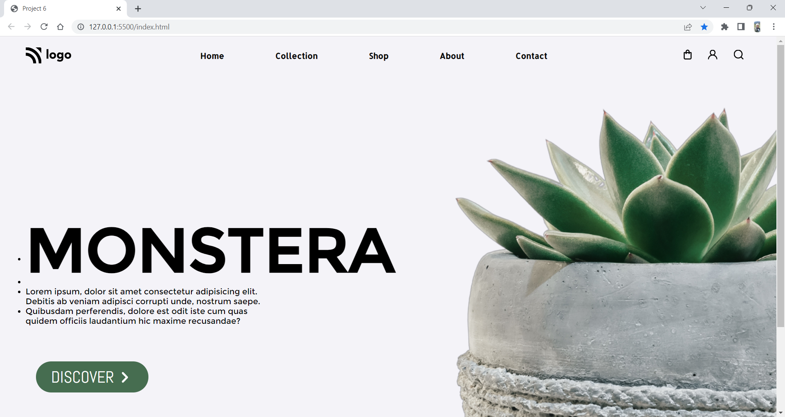

# Project 6: Plant Home Page

   

### Name:

> `Anshul Ghogre`

## Key Learnings from the project

- _Learned that flex box can be applied in every divor or section etc._
- _Learned to use IDs instead of classes._

---

### Screenshots:-

---

> Time taken to complete this project: 5hrs

---

## [Live-Link](https://project-5-crypto-landing-page.netlify.app//)

---
